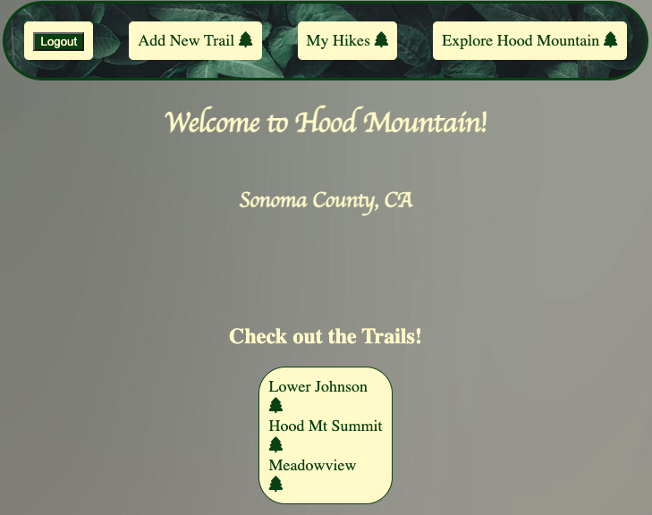

# Welcome to Sonoma Hiking!

## This application allows the user to explore the beautiful Hood Mountain in Sonoma County, CA. With the many trails, outlooks, and wildlife the user is sure to find their way to a great experience with nature- all with the guidnace of this application!

## Getting Started:

### Deployment
https://sonoma-hikes.herokuapp.com/
### Github
https://github.com/rharen11/sonoma-hikes
### Trello Planning Board
https://trello.com/b/AiJ9TXDx/hiking-app

## Technologies Used:
- HTML
- CSS
- Express with Node.js
- MongoDB with Mongoose
- git

## Credits

Used bootstrap for styling of cards (https://getbootstrap.com/docs/4.0/components/card/)

Google fonts (https://fonts.google.com/)

Font Awesome for icons (https://fontawesome.com/icons)

Artwork sourced from  (https://unsplash.com/photos/xljtGZ2-P3Y), special thanks to Nahil Naseer for the photograph (https://www.instagram.com/nahilnaseer/) and Thomas Lefebvre for the background image (https://www.instagram.com/imthebear_/).

## Next Steps

This application is a small jumping off point to a huge community for hikers. In the future I'd like to add features that allow hikers to look at other profiles and other hikers' accomplishments. Having a more interactive application is the goal, not only for users to interact with the application, but to connect with other people. The UI will most likely change in the future, too, as more locations are added along with index views of profiles, community review boards, areas to explore food, shopping, and other things people can do outside of hiking, and anything from user feedback. Logistical items I would like to add are light/dark mode, better background, and polished navigation bar. 